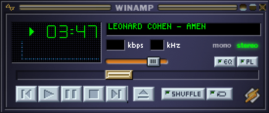
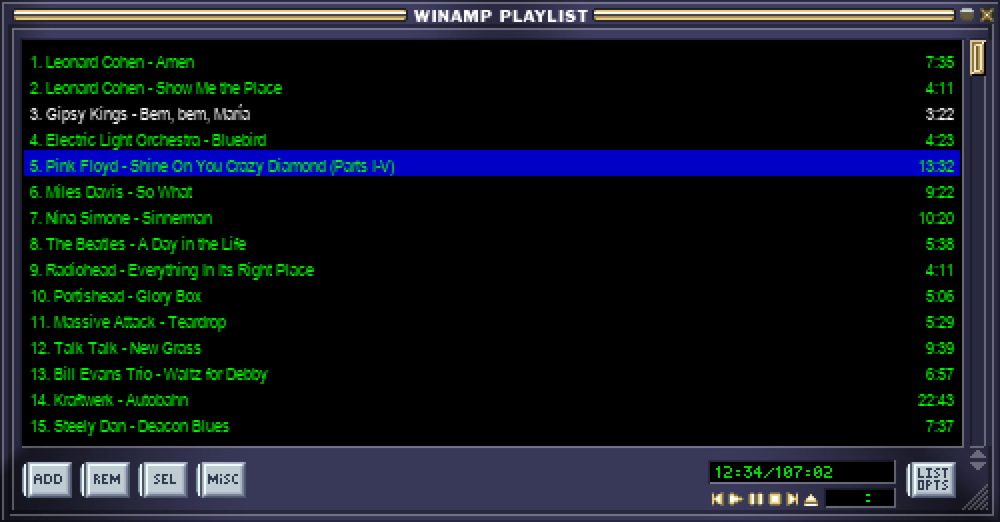
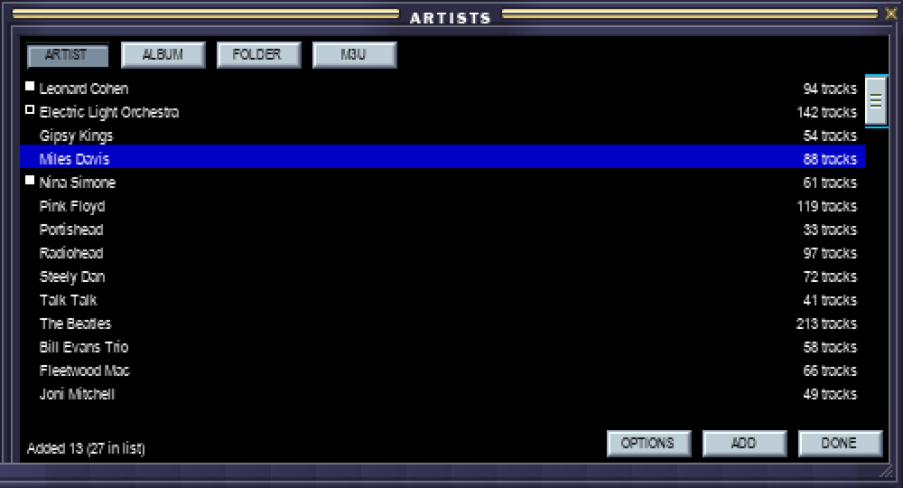

# Eversolo Winamp

A classic **Winamp 2.x** player for the **Eversolo DMP-A6**, running as a sideloaded
Android app on the streamer's own 6-inch touchscreen.



It does not play the audio itself. It drives the DMP-A6's built-in playback engine over the
device's local HTTP API, which bypasses Android's sample-rate conversion and reaches the
DACs bit-perfect. That is the whole point of the design: the stock engine still does all the
audio, and this only replaces its face.

> **Status:** running on the author's own DMP-A6. The main window and the playlist editor
> are confirmed working on the device; the library browser is new and has not been run on
> hardware yet. The equalizer window and the spectrum analyser are not built. See
> [PROJECT_PLAN.md](PROJECT_PLAN.md) for exactly where things stand.

---

## The windows

Three, as Winamp had, drawn from an ordinary `.wsz` skin. On a 6-inch screen there is no
room for two at a size where a track row can be tapped, so they take turns: **PL** swaps the
main window for the playlist, and the playlist's **X** swaps back.

### Playlist editor



Rendered from the skin's `pledit.bmp` at 2000×1044 — fifteen tracks, 52 px rows. The colours
come from the skin's own `pledit.txt`. All five fly-out menus work (ADD, REM, SEL, MISC and
LIST OPTS), and the running-time readout uses the skin's 5×6 bitmap font.

A single tap selects, a double tap plays, and the window's own ▶ button plays whatever is
selected — nothing is reachable only by a gesture.

### Library browser



On Winamp's *generic* window frame (`gen.bmp`), with the title in that bitmap's own
alphabet. Four ways in — **artist, album, folder and .m3u** — because a library ripped over
twenty years is not consistently tagged, and sometimes the folder tree is the only view that
makes sense.

It is a browser and nothing else: no transport, and tapping a track does not play it.
Tapping a folder or album opens it, tapping a track selects it, and **ADD** puts the
selection into the playlist — or everything currently listed, if nothing is selected.

---

## Why it is built the way it is

The DMP-A6 is a peculiar target, and most of the design follows from what it will not do.

| Constraint | Consequence |
|---|---|
| **No usable ADB.** Port 5555 accepts TCP but does not speak the protocol, and there is no reachable developer menu | No logcat and no debugger. The app carries its own ring-buffer log, an on-screen console (long-press the title bar) and an HTTP log shipper. Anything provable on a laptop is proved on a laptop |
| **The API has no queue manipulation at all** — every `addToQueue`-style call returns "Method Not Allowed" | The app owns the playlist and feeds the device one track at a time |
| **`openFile` replaces the device's whole queue** with the chosen track's containing folder | Playback is targeted by file path only; nothing can be addressed by id |
| **The API returns HTTP 200 for everything**, including files it silently refuses to play | Every play is confirmed against `getState` rather than trusted |
| **Starting playback brings the stock player to the front**, by either route, and an ordinary app cannot prevent it | The player runs as a floating overlay window, which sidesteps the fight entirely — and suits Winamp, which was always a floating window |
| **Android cannot read FLAC tags on this device** — `MediaMetadataRetriever` returns null | FLAC and ID3 tags are parsed by hand, in a module with no Android dependencies so it can be unit-tested |
| **Android cannot decode most Winamp skin bitmaps** — the classic skin is largely BI_RLE8, which `BitmapFactory` returns null for | The project ships its own BMP decoder |

The device API is written up in [API_FINDINGS.md](API_FINDINGS.md), what was measured on
real hardware in [ANSWERS_Q1_Q7.md](ANSWERS_Q1_Q7.md), and the layering in
[ARCHITECTURE.md](ARCHITECTURE.md).

---

## Building

Android Studio's JDK 21, Gradle 8.13, AGP 8.12.1, `compileSdk 34`, `targetSdk 29`
(`targetSdk 29` plus `requestLegacyExternalStorage` is the combination that gives direct
file access on this firmware; a sideloaded app has no Play Store targeting requirement).

```bash
# 1. put a classic Winamp .wsz in player/app/src/main/assets/skins/  (see the README there)
# 2. point Gradle at your SDK
echo "sdk.dir=$HOME/Library/Android/sdk" > player/local.properties
# 3. build
cd player && ./gradlew assembleDebug
```

**Bump `versionCode` in `player/app/build.gradle` before every build you intend to
install.** With an unchanged versionCode the device's installer reports success and quietly
keeps the app it already has, which looks exactly like the new code doing nothing.

### Installing

There is no ADB, so builds go on through the device's own web installer: open
`http://<device>:18888` in a **real desktop browser** and choose the APK. Driving that
upload from `curl` does not work — four approaches were tried and the server returns its
index page every time. A USB stick and the device's File app is the documented fallback.

With nothing playing, the main window's title strip shows the version that is actually
running, which is the quickest way to confirm an install took.

### Testing, without a device

```bash
./player/tools/run-jvm-tests.sh     # 156 assertions on a desktop JVM
```

It generates real audio fixtures with ffmpeg and compiles only the Android-free sources: the
tag parsers, the `.m3u` parser, the playlist model, and the window geometry. This exists
because there is no debugger on the device.

Skins can be rendered on the desktop before an install cycle, from the same sprite tables
the app uses:

```bash
./player/tools/preview/playlist_preview.py --width 500 --height 261 --scale 4 --menu add
./player/tools/preview/browser_preview.py
```

That has caught four real bugs so far without an install cycle: the wrong skin being
bundled, the RLE8 decoding problem, buttons one pixel too tall for the frame they sat on,
and button labels drawn in the skin's green LCD font, which is unreadable on grey.

Sprite coordinates are **generated, never typed** — `tools/gen-sprites.py` derives the main
and playlist tables from webamp, and `tools/gen-window-sprites.py` measures the generic
window frame out of `gen.bmp`, which marks its own pieces in a colour used nowhere else.

---

## Layout

```
player/                 the app
  app/                  window management, the browser model, the library scan
  core/                 logging, crash handler, log shipper
  library/              volume discovery, filesystem scan, the index
  tags/                 FLAC and ID3 parsers, .m3u parser   (no Android dependencies)
  playback/             the device's HTTP transport
  playlist/             the playlist model and sequencing   (no Android dependencies)
  skin/                 .wsz parsing, BMP decoding, and the three windows
  tools/                sprite generators, desktop previews, the JVM test runner
API_FINDINGS.md         the device's HTTP API: endpoints, schemas, limits
ANSWERS_Q1_Q7.md        what was measured on real hardware, and what was not
ARCHITECTURE.md         layer split and interfaces
PROJECT_PLAN.md         phased milestones and current status
CLAUDE.md               working rules and inherited facts
probe.py, enumerate.py  the API discovery tooling
discover2.py            SSDP discovery — find the device rather than hardcoding it
```

## Scope

Not a streaming client, not a replacement for the stock interface, not a remote control (it
runs *on* the device), not internet radio — the API rejects stream URLs — and not a firmware
project. No root, no patched system apps.

## Licence and attribution

MIT — see [LICENSE](LICENSE). Third-party material is listed in
[THIRD-PARTY-NOTICES.md](THIRD-PARTY-NOTICES.md); in short, sprite coordinates were derived
from [webamp](https://github.com/captbaritone/webamp) (MIT), and **no Winamp skin is
redistributed here** — you supply your own.

Not affiliated with Eversolo/Zidoo or with Winamp/Nullsoft. It talks to an undocumented
local API on hardware its owner paid for, and it will very likely break on a firmware
update.
